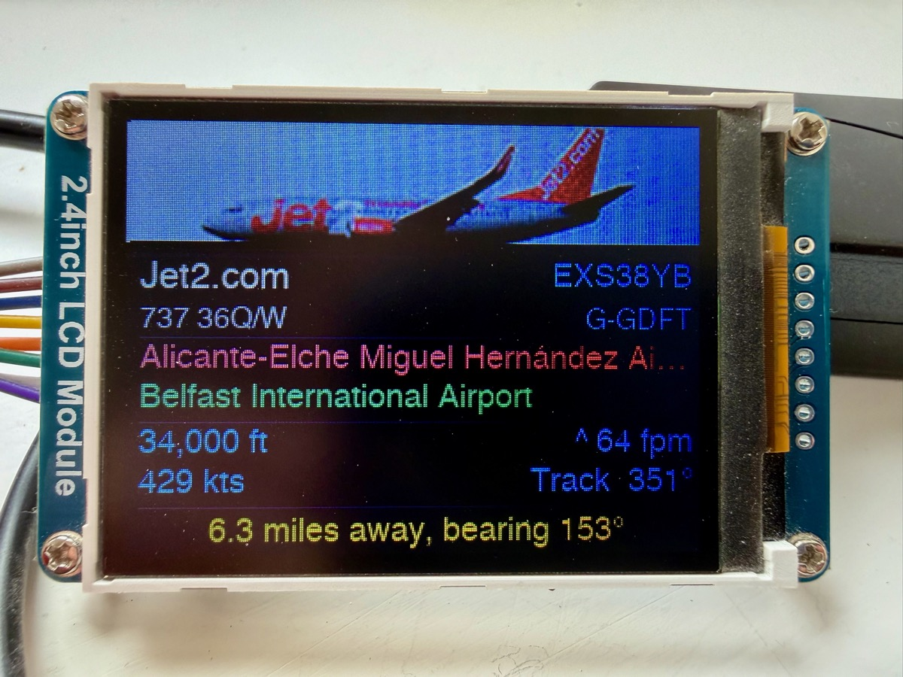
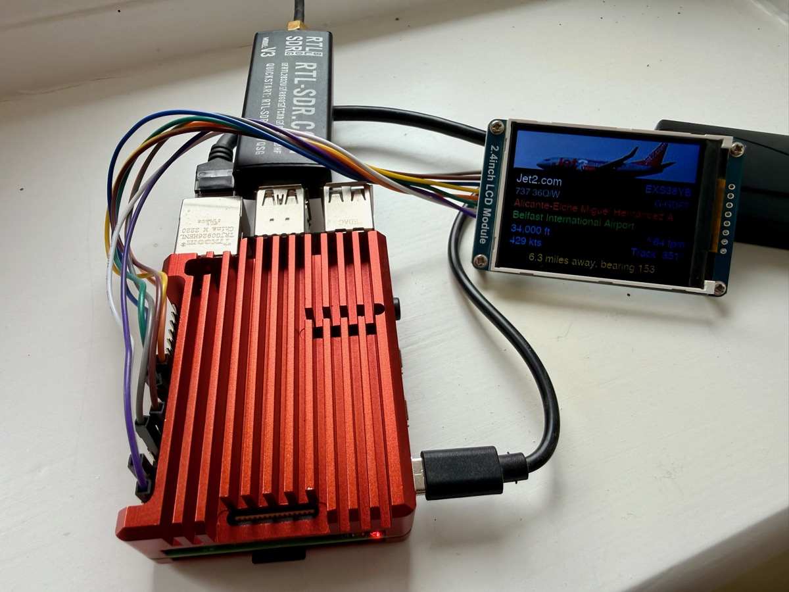

# fr24-display

A Raspberry Pi flight tracker that displays live ADS-B flight data on a Waveshare 2.4" LCD. It reads from the locally running FlightRadar24 "Build Your Own" receiver software and enriches the data with free external APIs — no FR24 subscription or API key required.



---

## Features

- **Live ADS-B data** — reads directly from the local dump1090/fr24feed JSON endpoint on your Pi
- **Closest aircraft tracking** — automatically finds and displays the nearest aircraft within a configurable radius
- **Rich flight info** — airline name, aircraft model, registration, callsign, origin, destination, altitude, vertical speed, ground speed, and heading
- **Aircraft photos** — fetched from Planespotters.net by ICAO hex code
- **Smart enrichment** — aircraft metadata and route data from adsbdb.com (no API key needed)
- **Offline name lookup** — airport and airline names from OpenFlights data, downloaded once and refreshed weekly
- **In-memory cache** — minimises API calls; aircraft metadata cached 24 h, routes 6 h, photos 24 h
- **Graceful degradation** — if any enrichment API is unavailable, raw ADS-B codes are shown rather than crashing
- **Auto-install** — requirements installed automatically from `requirements.txt` on every run
- **Auto-venv** — re-executes itself under the local `.venv` Python if launched with the system Python

---

## Architecture

```
┌─────────────────────────────────────────────────────────┐
│                   Raspberry Pi                          │
│                                                         │
│  RTL-SDR dongle → fr24feed/dump1090                    │
│                        │                               │
│            http://localhost:8080/data/aircraft.json    │
│                        │                               │
│               fr24-display.py                          │
│                        │                               │
│         ┌──────────────┼──────────────┐                │
│         ▼              ▼              ▼                │
│    adsbdb.com    Planespotters   OpenFlights           │
│  (reg/type/route)  (photos)    (airports/airlines)     │
│         │              │              │                │
│         └──────────────┴──────────────┘                │
│                        │                               │
│              Waveshare 2.4" LCD                        │
└─────────────────────────────────────────────────────────┘
```

### Data sources

| Source | Data provided | Cache TTL |
|--------|--------------|-----------|
| Local ADS-B (`localhost:8080`) | Position, altitude, speed, heading, callsign | Real-time (polled every `REFRESH_RATE` seconds) |
| [adsbdb.com](https://www.adsbdb.com) | Registration, aircraft type, operator, origin & destination airports | 24 h (aircraft), 6 h (route) |
| [airport-data.com](https://www.airport-data.com) | Aircraft photographs; model name fallback for unknown type codes | 24 h |
| [OurAirports](https://ourairports.com/data/) | Full airport names (actively maintained community dataset) | Downloaded to `data/`, refreshed weekly |
| Built-in table | ICAO type code → model name (e.g. `B738` → `Boeing 737-800`) | Static |

### Display layout (320 × 240 landscape)

```
┌──────────────────────────────────────────┐  ← 0 px
│                                          │
│        Aircraft photo (full width)       │  77 px
│                                          │
├──────────────────────────────────────────┤
│ British Airways                  BA0117  │  +25 px  (font 20 / 18)
│ Boeing 737-800                  G-EUPT  │  +18 px  (font 16)
├──────────────────────────────────────────┤
│ London Heathrow Airport                  │  +22 px  (font 18, red)
│ New York JFK Airport                     │  +22 px  (font 18, green)
├──────────────────────────────────────────┤
│ 35,000 ft               ^ 200 fpm        │  +22 px  (font 18)
│ 450 kts                   Track 270°     │  +22 px  (font 18)
├──────────────────────────────────────────┤
│  12.5 miles away, bearing 270°           │  +23 px  (font 18, amber)
└──────────────────────────────────────────┘  ← 240 px
```

Vertical speed indicator: `^` climbing, `v` descending, `~` level (within ±50 fpm).

---

## Hardware requirements

- Raspberry Pi (any model with 40-pin GPIO header — tested on Pi 3/4/Zero 2 W)
- RTL-SDR USB dongle (e.g. RTL2832U) with 1090 MHz antenna
- [Waveshare 2.4" LCD HAT](https://www.waveshare.com/2.4inch-lcd-module.htm) (ST7789 driver, 240 × 320 px)
- MicroSD card (8 GB+) running Raspberry Pi OS Lite or Desktop
- Internet connection for first-run data download and API enrichment



---

## Wiring the Waveshare 2.4" LCD

The display uses the SPI0 bus. Connect it to your Raspberry Pi's 40-pin GPIO header as follows:

```
Waveshare 2.4" LCD          Raspberry Pi 40-pin header
─────────────────           ──────────────────────────
VCC  ──────────────────────  Pin  1  (3.3 V)
GND  ──────────────────────  Pin  6  (GND)
DIN  ──────────────────────  Pin 19  (GPIO 10 / SPI0 MOSI)
CLK  ──────────────────────  Pin 23  (GPIO 11 / SPI0 SCLK)
CS   ──────────────────────  Pin 24  (GPIO  8 / SPI0 CE0)
DC   ──────────────────────  Pin 22  (GPIO 25)
RST  ──────────────────────  Pin 13  (GPIO 27)
BL   ──────────────────────  Pin 12  (GPIO 18 / PWM0)
```

Raspberry Pi GPIO header reference (odd pins on left, even on right):

```
        3V3  [ 1] [ 2]  5V
      GPIO2  [ 3] [ 4]  5V
      GPIO3  [ 5] [ 6]  GND  ◄── GND
      GPIO4  [ 7] [ 8]  GPIO14
        GND  [ 9] [10]  GPIO15
     GPIO17  [11] [12]  GPIO18  ◄── BL
     GPIO27  [13] [14]  GND
     GPIO22  [15] [16]  GPIO23
        3V3  [17] [18]  GPIO24
     GPIO10  [19] [20]  GND
      GPIO9  [21] [22]  GPIO25  ◄── DC
     GPIO11  [23] [24]  GPIO8
        GND  [25] [26]  GPIO7
      GPIO0  [27] [28]  GPIO1
      GPIO5  [29] [30]  GND
      GPIO6  [31] [32]  GPIO12
     GPIO13  [33] [34]  GND
     GPIO19  [35] [36]  GPIO16
     GPIO26  [37] [38]  GPIO20
        GND  [39] [40]  GPIO21

  ◄── Pin 1 (3V3) ── VCC
  ◄── Pin 19 (MOSI) ── DIN
  ◄── Pin 23 (SCLK) ── CLK
  ◄── Pin 24 (CE0) ── CS
  ◄── Pin 13 (GPIO27) ── RST
```

> **Note:** If your display module has a HAT form factor it will plug directly onto the GPIO header — no individual wiring needed. Check your specific Waveshare product page to confirm.

---

## Software installation

### 1. Set up your ADS-B receiver

Follow the [FlightRadar24 Build Your Own](https://www.flightradar24.com/build-your-own) guide to install and configure `fr24feed` and `dump1090` on your Pi. Once complete, verify the local feed is working:

```bash
curl http://localhost:8080/data/aircraft.json | python3 -m json.tool | head -30
```

You should see a JSON response with an `aircraft` array.

### 2. Enable SPI

```bash
sudo raspi-config
# Interface Options → SPI → Enable
sudo reboot
```

Verify SPI is enabled after reboot:

```bash
ls /dev/spidev0.*
# Should show: /dev/spidev0.0  /dev/spidev0.1
```

### 3. Install system dependencies

```bash
sudo apt update
sudo apt install -y python3-pip python3-venv python3-dev libopenblas-dev libjpeg-dev
```

### 4. Clone the repository

```bash
cd /home/pi
git clone https://github.com/timhanley/fr24-display.git
cd fr24-display
```

### 5. Create the virtual environment

```bash
python3 -m venv .venv
```

Python packages are installed automatically on first run, but you can also pre-install them:

```bash
.venv/bin/pip install -r requirements.txt
```

### 6. Configure

Copy the example file and edit it:

```bash
cp .env.example .env
nano .env
```

```ini
# Your receiver location (from Google Maps — right-click → copy coordinates)
LAT=your_latitude_here
LON=your_longitude_here

# Search radius in kilometres
RADIUS_KM=50

# Local ADS-B JSON feed URL
ADSB_URL=http://localhost:8080/data/aircraft.json

# Seconds between display updates (minimum 15 recommended)
REFRESH_RATE=30
```

### 7. Run

```bash
chmod +x fr24-display.py
./fr24-display.py
```

On first run the script will:
1. Install any missing Python packages
2. Download `airports.csv` from OurAirports (~7 MB)
3. Start polling your local ADS-B feed

---

## Run at startup with systemd

Create a service file:

```bash
sudo nano /etc/systemd/system/fr24-display.service
```

```ini
[Unit]
Description=FR24 Flight Display
After=network-online.target fr24feed.service
Wants=network-online.target

[Service]
Type=simple
User=pi
WorkingDirectory=/home/pi/fr24-display
ExecStart=/home/pi/fr24-display/.venv/bin/python /home/pi/fr24-display/fr24-display.py
Restart=on-failure
RestartSec=10

[Install]
WantedBy=multi-user.target
```

> **`User=pi`** — Replace `pi` with your actual username if you set a different one during Raspberry Pi OS setup (newer images no longer default to `pi`). Likewise update the two `WorkingDirectory` / `ExecStart` paths to match.

> **`After=fr24feed.service`** — This dependency only applies if you are using the FR24 Build Your Own software. If you are running standalone `dump1090` instead, replace it with `dump1090.service` (or remove it entirely — the script will simply retry on the next poll cycle if the feed isn't ready yet).

Enable and start the service:

```bash
sudo systemctl daemon-reload
sudo systemctl enable fr24-display.service
sudo systemctl start fr24-display.service
```

Check status and logs:

```bash
sudo systemctl status fr24-display.service
sudo journalctl -u fr24-display.service -f
```

---

## Troubleshooting

| Symptom | Likely cause | Fix |
|---------|-------------|-----|
| `No aircraft nearby` on screen | ADS-B feed not reachable or radius too small | Check `curl $ADSB_URL` returns data; increase `RADIUS_KM` |
| `ADS-B fetch failed` in logs | dump1090/fr24feed not running | `sudo systemctl status fr24feed` |
| Display stays blank / white | SPI not enabled or wiring error | Re-check `raspi-config` SPI setting and wiring table above |
| `Display init failed` | GPIO/SPI permissions | Run as `pi` user or add user to `gpio` and `spi` groups: `sudo usermod -aG gpio,spi pi` |
| Airport names showing as IATA codes | OurAirports download failed at startup | Check internet connection; file saves to `data/` and retries weekly |
| Wrong origin or destination shown | adsbdb stores historical callsign→route associations; callsigns are reused across seasons | No fix — upstream data limitation; primary flight data is still correct |
| Photos not showing | airport-data.com API unreachable | Expected occasionally; `noimage.png` is shown as fallback |
| `pip install` slow on every start | Normal on first run only | Once packages are installed in `.venv` subsequent installs are instant |

---

## Project structure

```
fr24-display/
├── fr24-display.py       Main script
├── requirements.txt      Python dependencies
├── .env                  Configuration (not committed)
├── .gitignore
├── README.md
├── Font/
│   └── helvetica.ttf     Display font
├── images/
│   ├── noimage.png       Fallback when no photo available
│   └── error.png         Shown when no aircraft detected
├── lib/
│   ├── LCD_2inch4.py     Waveshare display driver
│   ├── lcdconfig.py      SPI/GPIO base class
│   └── __init__.py
└── data/                 Auto-created on first run
    └── airports.csv      OurAirports data (refreshed weekly)
```

---

## Acknowledgements

- [OurAirports](https://ourairports.com) — airport data
- [adsbdb.com](https://www.adsbdb.com) by [@mrjackwills](https://github.com/mrjackwills/adsbdb) — free aircraft and route lookup API
- [airport-data.com](https://www.airport-data.com) — aircraft photo and info API
- [FlightRadar24](https://www.flightradar24.com/build-your-own) — Build Your Own ADS-B receiver software
- [Waveshare](https://www.waveshare.com) — LCD display and driver library
